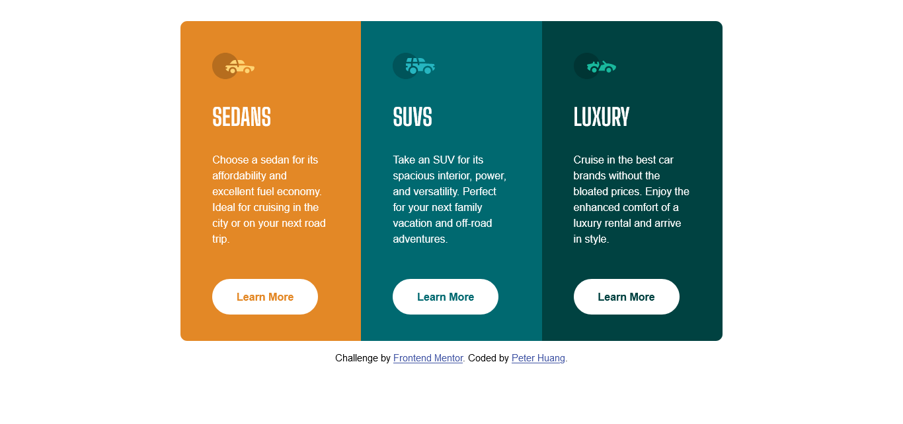

# Frontend Mentor - 3-column preview card component solution

This is a solution to the [3-column preview card component challenge on Frontend Mentor](https://www.frontendmentor.io/challenges/3column-preview-card-component-pH92eAR2-).

## Table of contents

- [Overview](#overview)
  - [The challenge](#the-challenge)
  - [Screenshot](#screenshot)
  - [Links](#links)
- [My process](#my-process)
  - [Built with](#built-with)
- [Author](#author)
- [Acknowledgments](#acknowledgments)

## Overview

### The challenge

Users should be able to:

- View the optimal layout depending on their device's screen size
- See hover states for interactive elements

### Screenshot

### Links

- Solution URL: [https://www.frontendmentor.io/solutions/using-scss-and-flexbox-5F-56Nx2s](https://www.frontendmentor.io/solutions/using-scss-and-flexbox-5F-56Nx2s)
- Live Site URL: [https://3column-preview-card.netlify.app/](https://3column-preview-card.netlify.app/)

## My process

### Built with

- Semantic HTML5 markup
- CSS custom properties
- Flexbox
- Media Query

## Author

- Github - [Peter Huang](https://github.com/PeterHuang-13)
- Frontend Mentor - [@PeterHuang-13](https://www.frontendmentor.io/profile/PeterHuang-13)
