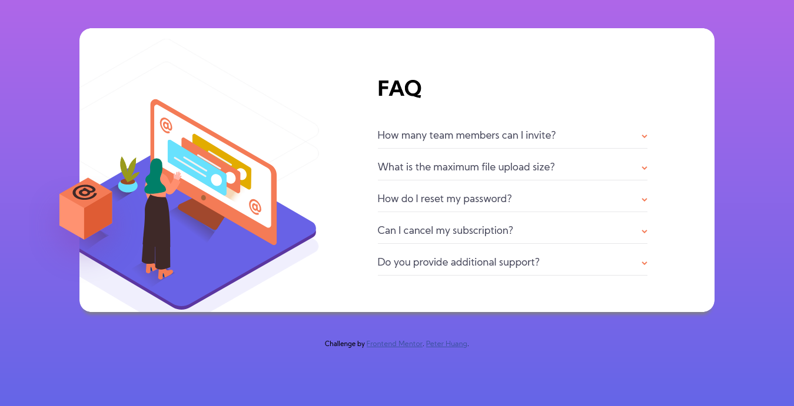

# Frontend Mentor - FAQ accordion card solution

This is a solution to the [FAQ accordion card challenge on Frontend Mentor](https://www.frontendmentor.io/challenges/faq-accordion-card-XlyjD0Oam).

## Table of contents

- [Overview](#overview)
  - [The challenge](#the-challenge)
  - [Screenshot](#screenshot)
  - [Links](#links)
- [My process](#my-process)
  - [Built with](#built-with)
  - [What I learned](#what-i-learned)
  - [Useful resources](#useful-resources)
- [Author](#author)

## Overview

### The challenge

Users should be able to:

- View the optimal layout for the component depending on their device's screen size
- See hover states for all interactive elements on the page
- Hide/Show the answer to a question when the question is clicked

### Screenshot



### Links

- Solution URL: [Add solution URL here](https://your-solution-url.com)
- Live Site URL: [https://faq-accordion-solution.netlify.app/](https://faq-accordion-solution.netlify.app/)

## My process

### Built with

- Semantic HTML5 markup
- CSS custom properties
- Flexbox
- JavaScript

### What I learned

- accordion

```js
const acc = document.getElementsByClassName("accordion");

for (let i = 0; i < acc.length; i++) {
  acc[i].addEventListener("click", function () {
    /* Toggle between adding and removing the "active" class,
    to highlight the button that controls the panel */
    this.classList.toggle("active");
    hideAll(this);

    /* Toggle between hiding and showing the active panel */
    let panel = this.nextElementSibling;
    if (panel.style.maxHeight) {
      panel.style.maxHeight = null;
      panel.style.margin = null;
    } else {
      panel.style.maxHeight = panel.scrollHeight + 16 + "px";
      panel.style.margin = "0rem 0rem 1rem 0rem";
    }
  });
}

// accordions auto close function
function hideAll(exceptThis) {
  for (let i = 0; i < acc.length; i++) {
    if (acc[i] !== exceptThis) {
      acc[i].classList.remove("active");
      let panel = acc[i].nextElementSibling;
      panel.style.maxHeight = null;
      panel.style.margin = null;
    }
  }
}
```

### Useful resources

- [https://www.w3schools.com/howto/howto_js_accordion.asp](https://www.w3schools.com/howto/howto_js_accordion.asp) - This helped me for understand accordion.

## Author

- Github - [Peter Huang](https://github.com/PeterHuang-13)
- Frontend Mentor - [@PeterHuang-13](https://www.frontendmentor.io/profile/PeterHuang-13)
