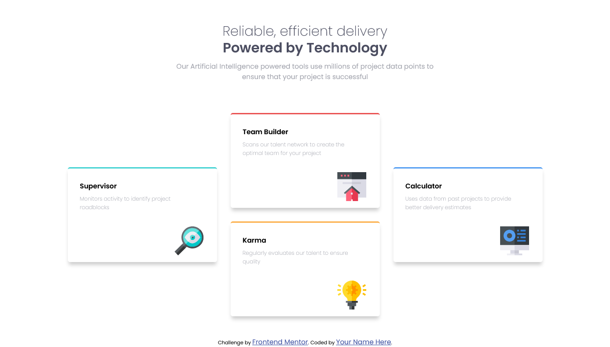

# Frontend Mentor - Four card feature section solution

This is a solution to the [Four card feature section challenge on Frontend Mentor](https://www.frontendmentor.io/challenges/four-card-feature-section-weK1eFYK).

## Table of contents

- [Overview](#overview)
  - [The challenge](#the-challenge)
  - [Screenshot](#screenshot)
  - [Links](#links)
- [My process](#my-process)
  - [Built with](#built-with)
  - [What I learned](#what-i-learned)
- [Author](#author)

## Overview

### The challenge

Users should be able to:

- View the optimal layout for the site depending on their device's screen size

### Screenshot

### Links

- Solution URL: [https://www.frontendmentor.io/solutions/using-scss-and-flexbox-5F-56Nx2s](https://www.frontendmentor.io/solutions/using-scss-and-flexbox-5F-56Nx2s)
- Live Site URL: [https://four-card-feature-by-peter.netlify.app/](https://four-card-feature-by-peter.netlify.app/)

## My process

### Built with

- Semantic HTML5 markup
- CSS custom properties
- CSS Grid

## Author

- Github - [Peter Huang](https://github.com/PeterHuang-13)
- Frontend Mentor - [@PeterHuang-13](https://www.frontendmentor.io/profile/PeterHuang-13)
