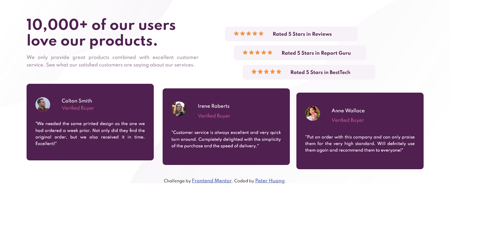

# Frontend Mentor - Social proof section solution

This is a solution to the [Social proof section challenge on Frontend Mentor](https://www.frontendmentor.io/challenges/social-proof-section-6e0qTv_bA).

## Table of contents

- [Overview](#overview)
  - [The challenge](#the-challenge)
  - [Screenshot](#screenshot)
  - [Links](#links)
- [My process](#my-process)
  - [Built with](#built-with)
  - [What I learned](#what-i-learned)
- [Author](#author)
- [Acknowledgments](#acknowledgments)

## Overview

### The challenge

Users should be able to:

- View the optimal layout for the section depending on their device's screen size

### Screenshot

### Links

- Solution URL: [https://www.frontendmentor.io/solutions/using-grid-eVO553oAJ](https://www.frontendmentor.io/solutions/using-grid-eVO553oAJ)
- Live Site URL: [https://social-proof-section-solution.netlify.app/](https://social-proof-section-solution.netlify.app/)

## My process

### Built with

- Semantic HTML5 markup
- CSS custom properties
- Flexbox
- CSS Grid
- Media Query

### What I learned

It's the first time using grid.

## Author

- Github - [Peter Huang](https://github.com/PeterHuang-13?tab=repositories)
- Frontend Mentor - [@PeterHuang-13](https://www.frontendmentor.io/profile/PeterHuang-13)
